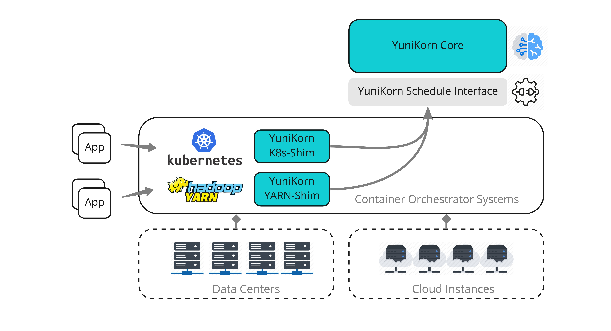

# YuniKorn - A Universal Scheduler

----

YuniKorn is a light-weighted, universal resource scheduler for container orchestrator systems.
It was created to achieve fine-grained resource sharing for various workloads efficiently on a large scale, multi-tenant,
and cloud-native environment. YuniKorn brings a unified, cross-platform scheduling experience for mixed workloads consists
of stateless batch workloads and stateful services. Support for but not limited to, YARN and Kubernetes.

## Architecture

Following chart illustrates the high-level architecture of YuniKorn.

YuniKorn consists of the following components spread over multiple code repositories.

- _Scheduler core_: the brain of the scheduler, which makes placement decisions (Allocate container X on node Y)
  according to pre configured policies. See more in current repo [yunikorn-core](https://github.com/apache/incubator-yunikorn-core).
- _Scheduler interface_: the common scheduler interface used by shims and the core scheduler.
  Contains the API layer (with GRPC/programming language bindings) which is agnostic to container orchestrator systems like YARN/K8s.
  See more in [yunikorn-scheduler-interface](https://github.com/apache/incubator-yunikorn-scheduler-interface).
- _Resource Manager shims_: allow container orchestrator systems talks to yunikorn-core through scheduler-interface.
   Which can be configured on existing clusters without code change.
   Currently, [yunikorn-k8shim](https://github.com/apache/incubator-yunikorn-k8shim) is available for Kubernetes integration. 
- _Scheduler User Interface_: the YuniKorn web interface for app/queue management.
   See more in [yunikorn-web](https://github.com/apache/incubator-yunikorn-web).
## Key features

Here are some key features of YuniKorn.

- Features to support both batch jobs and long-running/stateful services
- Hierarchy queues with min/max resource quotas.
- Resource fairness between queues, users and apps.
- Cross-queue preemption based on fairness.
- Customized resource types (like GPU) scheduling support.
- Rich placement constraints support.
- Automatically map incoming container requests to queues by policies. 
- Node partition: partition cluster to sub-clusters with dedicated quota/ACL management. 

You can find more information about what are already supported and future plans in the [Road Map](docs/roadmap.md).

## How to use

The simplest way to run YuniKorn is to build a docker image and then deployed to Kubernetes with a yaml file,
running as a customized scheduler. Then you can run workloads with this scheduler.
See more instructions from the [User Guide](./docs/user-guide.md).

## How can I get involved?

We welcome any form of contributions, code, documentation or even discussions. To get involved, please read following resources.
- Before you contributing code or documentation to YuniKorn, please read our [Developer Guide](docs/developer-guide.md).
- When you are coding use the [Coding Guideines](docs/coding-guidelines.md).
- Please read [How to Contribute](docs/how-to-contribute.md) to understand the procedure and guidelines of making contributions.

## Other Resources

**Demo videos**

- Subscribe to [YuniKorn Youtube Channel](https://www.youtube.com/channel/UCDSJ2z-lEZcjdK27tTj_hGw) to get notification about new demos!
- [Running YuniKorn on Kubernetes - a 12 minutes Hello-world demo](https://www.youtube.com/watch?v=cCHVFkbHIzo)
- [YuniKorn configuration hot-refresh introduction](https://www.youtube.com/watch?v=3WOaxoPogDY)
- [Yunikorn scheduling and volumes on Kubernetes](https://www.youtube.com/watch?v=XDrjOkMp3k4)
- [Yunikorn placement rules for applications](https://www.youtube.com/watch?v=DfhJLMjaFH0)

**Communication channels**

- We use [Slack](https://slack.com/) as our primary collaboration system, you can join us by accessing [this link](https://join.slack.com/t/yunikornworkspace/shared_invite/enQtNzAzMjY0OTI4MjYzLTBmMDdkYTAwNDMwNTE3NWVjZWE1OTczMWE4NDI2Yzg3MmEyZjUyYTZlMDE5M2U4ZjZhNmYyNGFmYjY4ZGYyMGE).
Currently, we have following channels in the workspace: `#yunikorn-dev` and `#yunikorn-user`.
- Google Group: https://groups.google.com/d/forum/yunikorn
- Mailing list: yunikorn@googlegroups.com  

**Blog posts**

- [YuniKorn: a universal resource scheduler](https://blog.cloudera.com/blog/2019/07/yunikorn-a-universal-resource-scheduler/)

