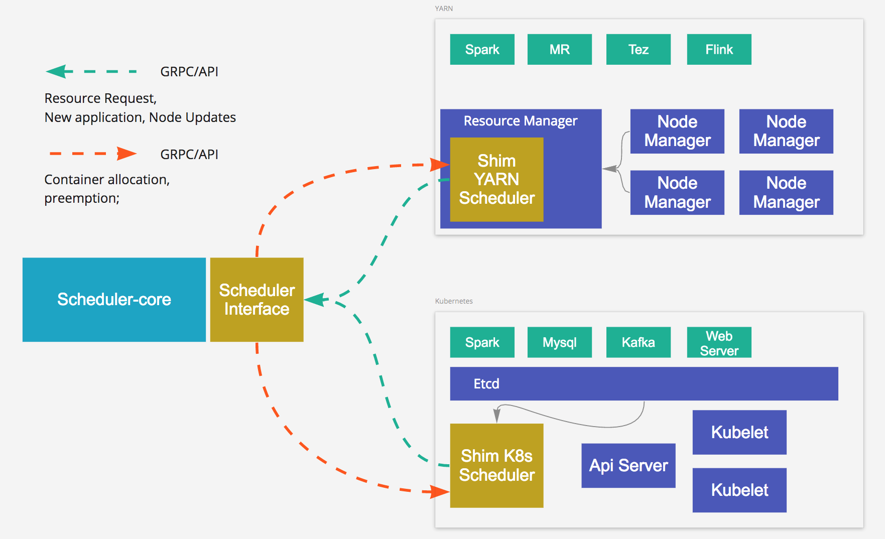
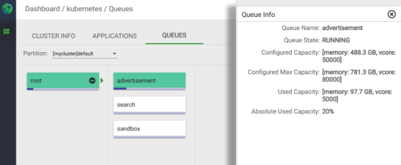
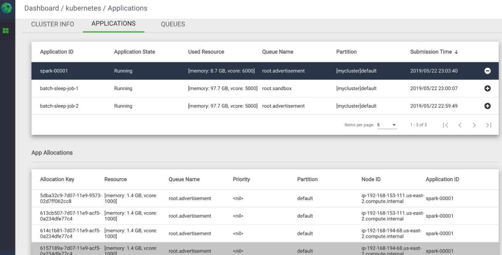

# Apache YuniKorn (incubating) - A Universal Scheduler

----

Apache YuniKorn (incubating) is a light-weighted, universal resource scheduler for container orchestrator systems.
It was created to achieve fine-grained resource sharing for various workloads efficiently on a large scale, multi-tenant,
and cloud-native environment. YuniKorn brings a unified, cross-platform scheduling experience for mixed workloads consists
of stateless batch workloads and stateful services. 

YuniKorn now supports K8s and can be deployed as a custom K8s scheduler. YuniKorn's architecture design also allows adding different
shim layer and adopt to different ResourceManager implementation including Apache Hadoop YARN, or any other systems. 

## Architecture

Following chart illustrates the high-level architecture of YuniKorn.

YuniKorn consists of the following components spread over multiple code repositories, most of the following projects are written in GoLang.

- _Scheduler core_: the brain of the scheduler, which makes placement decisions (Allocate container X on node Y)
  according to pre configured policies. See more in current repo [yunikorn-core](https://github.com/apache/incubator-yunikorn-core).
  _Scheduler core_ is implemented in a way to be agnostic to scheduler implementation.
- _Scheduler interface_: the common scheduler interface used by shims and the core scheduler.
  Contains the API layer (with GRPC/programming language bindings) which is agnostic to container orchestrator systems like YARN/K8s.
  See more in [yunikorn-scheduler-interface](https://github.com/apache/incubator-yunikorn-scheduler-interface).
- _Resource Manager shims_: allow container orchestrator systems talks to yunikorn-core through scheduler-interface.
   Which can be configured on existing clusters without code change.
   
   Currently, [yunikorn-k8shim](https://github.com/apache/incubator-yunikorn-k8shim) is available for Kubernetes integration. 
   Supporting other Resource Manager is our next priority.
- _Scheduler User Interface_: the YuniKorn web interface for app/queue management.
   See more in [yunikorn-web](https://github.com/apache/incubator-yunikorn-web).

## Feature highlights

### Main scheduling features:

- Features to support both batch jobs and long-running/stateful services
- Hierarchy queues with min/max resource quotas.
- Resource fairness between queues, users and apps.
- Cross-queue preemption based on fairness.
- Customized resource types (like GPU) scheduling support.
- Rich placement constraints support.
- Automatically map incoming container requests to queues by policies. 
- Node partition: partition cluster to sub-clusters with dedicated quota/ACL management.

### Integration with K8s:

The `k8shim` provides the integration for K8s scheduling and supported features include: 

- _Predicates:_ All kinds of predicates such as node-selector, pod affinity/anti-affinity, taint/tolerant, etc.
- _Persistent volumes:_ We have verified hostpath, EBS, NFS, etc. 
- _K8s namespace awareness:_ YuniKorn support hierarchical of queues, does it mean you need to give up K8s namespace? Answer is no, with simple config, YuniKorn is able to 
 support automatically map K8s namespaces to YuniKorn queues. All K8s-namespace-related ResourceQuota, permissions will be still valid.
- _Metrics:_ Prometheus, Grafana integration.
- _Cluster AutoScaler_: YuniKorn can nicely work with Cluster AutoScaler (https://github.com/kubernetes/autoscaler/tree/master/cluster-autoscaler) to drive cluster scales up and down.
- _K8s Events_: YuniKorn also integrated with K8s events, so lots of information can be retrieved by using `kubectl describe pod`.

#### Performance testing
We love high-performance software, and we made tremendous efforts to make it to support large scale cluster and high-churning tasks. 
Here's [Performance Test Result](docs/evaluate-perf-function-with-Kubemark.md) 

#### Deployment model
Yunikorn can be deployed as a K8s custom scheduler, and take over all POD scheduling. 
An enhancement is open to improve coexistence behaviour of the YuniKorn scheduler with other Kubernetes schedulers,
like the default scheduler, in the cluster: [Co-existing with other K8s schedulers](https://issues.apache.org/jira/browse/YUNIKORN-16). 
 
#### Verified K8s versions 

| K8s Version   | Support?  |
| ------------- |:-------------:|
| 1.12.x (or earlier) | X |
| 1.13.x | √ |
| 1.14.x | √ |
| 1.15.x | √ |
| 1.16.x | To be verified |
| 1.17.x | To be verified |

### Web UI

YuniKorn has builtin web UIs for queue hierarchies and apps. See below: 

## Roadmap

Want to learn more about future of YuniKorn? You can find more information about what are already supported and future plans in the [Road Map](docs/roadmap.md).

## How to use

The simplest way to run YuniKorn is to build a docker image and then deployed to Kubernetes with a yaml file,
running as a customized scheduler. Then you can run workloads with this scheduler.
See more instructions from the [User Guide](./docs/user-guide.md).

## How can I get involved?

Apache YuniKorn (incubating) community includes engineers from Alibaba, Apple, 
Cloudera, Linkedin, Microsoft, Nvidia, Tencent, Uber, etc. (sorted by alphabet). Want to join the community? 
We welcome any form of contributions, code, documentation or suggestions! 

To get involved, please read following resources.
- Logging an issue or improvement use the [Reporting an issue Guide](docs/reporting-issues.md).
- Before you contributing code or documentation to YuniKorn, please read our [Developer Guide](docs/developer-guide.md).
- When you are coding use the [Coding Guidelines](docs/coding-guidelines.md).
- Please read [How to Contribute](docs/how-to-contribute.md) to understand the procedure and guidelines of making contributions.
- We have periodically community sync ups in multiple timezones and languages, please find [Community Syncup](docs/community-sync-up.md) to attend online sync ups. 

## Other Resources

**Demo videos**

- Subscribe to [YuniKorn Youtube Channel](https://www.youtube.com/channel/UCDSJ2z-lEZcjdK27tTj_hGw) to get notification about new demos!
- [Running YuniKorn on Kubernetes - a 12 minutes Hello-world demo](https://www.youtube.com/watch?v=cCHVFkbHIzo)
- [YuniKorn configuration hot-refresh introduction](https://www.youtube.com/watch?v=3WOaxoPogDY)
- [Yunikorn scheduling and volumes on Kubernetes](https://www.youtube.com/watch?v=XDrjOkMp3k4)
- [Yunikorn placement rules for applications](https://www.youtube.com/watch?v=DfhJLMjaFH0)

**Communication channels**

- Mailing lists are:
  - [user@yunikorn.apache.org](mailto:user@yunikorn.apache.org) user questions list
  - [dev@yunikorn.apache.org](mailto:dev@yunikorn.apache.org) development discussions
  - [issues@yunikorn.apache.org](mailto:issues@yunikorn.apache.org) JIRA issue feed
- We use [Slack](https://slack.com/) as our collaboration system, you can join us by accessing [this link](https://join.slack.com/t/yunikornworkspace/shared_invite/enQtNzAzMjY0OTI4MjYzLTBmMDdkYTAwNDMwNTE3NWVjZWE1OTczMWE4NDI2Yzg3MmEyZjUyYTZlMDE5M2U4ZjZhNmYyNGFmYjY4ZGYyMGE).
Currently, we have following channels in the workspace: `#yunikorn-dev` and `#yunikorn-user`.

**Blog posts**

- [YuniKorn: a universal resource scheduler](https://blog.cloudera.com/blog/2019/07/yunikorn-a-universal-resource-scheduler/)
