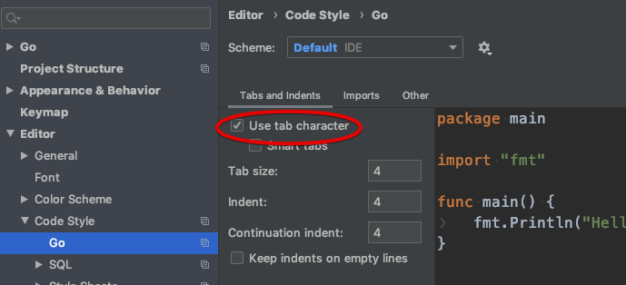
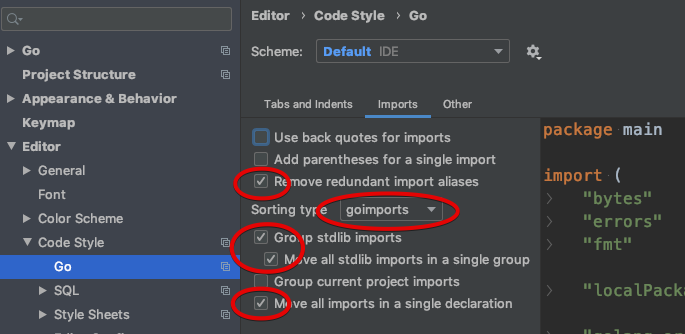
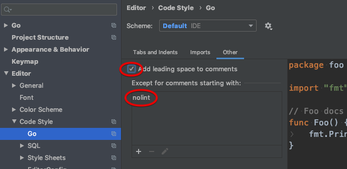
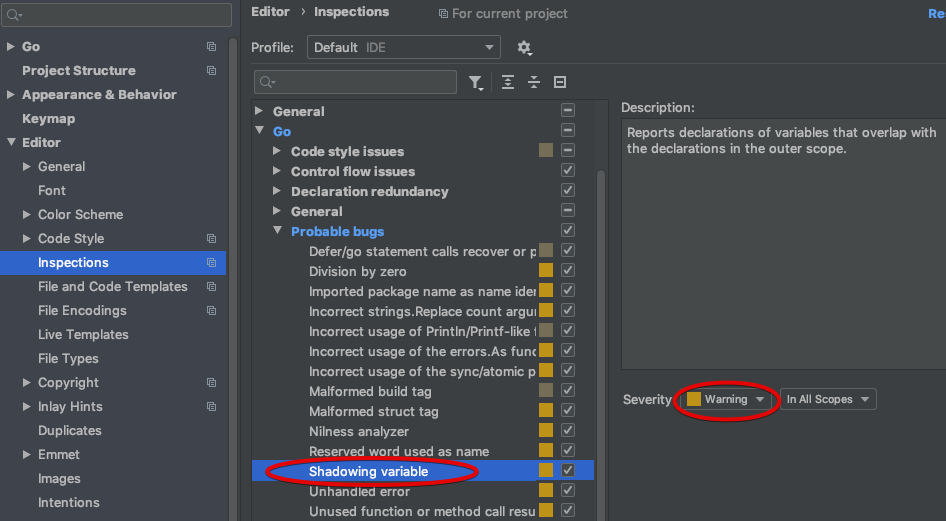

<!--
 * Licensed to the Apache Software Foundation (ASF) under one
 * or more contributor license agreements.  See the NOTICE file
 * distributed with this work for additional information
 * regarding copyright ownership.  The ASF licenses this file
 * to you under the Apache License, Version 2.0 (the
 * "License"); you may not use this file except in compliance
 * with the License.  You may obtain a copy of the License at
 *
 *     http://www.apache.org/licenses/LICENSE-2.0
 *
 * Unless required by applicable law or agreed to in writing, software
 * distributed under the License is distributed on an "AS IS" BASIS,
 * WITHOUT WARRANTIES OR CONDITIONS OF ANY KIND, either express or implied.
 * See the License for the specific language governing permissions and
 * limitations under the License.
 -->

# Coding Guidelines

## The basics
GO as a language provides a build in formatter for the code: `gofmt`.
The project uses the predefined format as implemented in `gofmt`.
That means tabs and not spaces etc.
Read the [Effective GO](https://golang.org/doc/effective_go.html) page for further details.
Before creating a pull request make sure the code at least is formatted using `gofmt`.

Beside the effective GO guide follow the recommendations from the [CodeReviewComments](https://github.com/golang/go/wiki/CodeReviewComments) wiki page.
The wiki provides a good collection of comments from code reviews.
Most of the comments will be checked in the automated checks described below.

When using an IDE, like GoLand or Visual Studio Code, use the builtin options.
Most IDEs will provide an extensive list of checks or formatting options that help formatting and point out code issues.
See [IDE setup](#goland-ide-setup) for a basic setup for the GoLand IDE. 

## Automated checks
Not all code will be written using an IDE.
Even between contributors the settings might not be the same in all installs.
To help keep code formatted consistently a [lint](https://en.wikipedia.org/wiki/Lint_(software)) tool is part of the code approval.   

There are a large number of lint tools are available for Go.
Most of the lint tools only check one specific thing.
Some of the tools will aggregate a number of linters and provide an overview of all the issues found. 
For the project we have chosen the [golangci-lint](https://github.com/golangci/golangci-lint) tool.
The tool can be run locally and will be integrated into the GitHub PR flow.

### Installing and running locally
Depending on your development system the instructions might differ slightly.
Follow the [installation instructions](https://github.com/golangci/golangci-lint#install) provided by the project.

After the tool is installed you can run it using the standard command line: 
```shell script
golangci-lint run
```
The projects still generate a number of warnings.
The high impact warnings have been fixed or ignored via comments, see [False positives](#false-positives).

If you have been working on a new feature or a bug you only want to check the files that have changed.
You can run the tool with the option `--new` or `--new-from-rev` option.
The `--new` option will only check uncommitted files.
The `--new-from-rev` option will check changes against a specific committed revision.

```shell script
# for uncommitted changes
golangci-lint run --new
# for committed changes against a revision
golangci-lint run --new-from-rev=origin/master
```
The `make` integration checks two locations for the executable and uses the `--new` command line option.
* `go env GOPATH)/bin/`
* `./bin/` (relative to the project)

The make target is `lint`:
```shell script
make lint
```

See the golangci-lint product documentation for more options and information on how to run the tool.

### Configuration
A predefined configuration is provided for the two projects that use them:
* [YuniKorn k8shim](https://github.com/apache/incubator-yunikorn-k8shim)
* [YuniKorn core](https://github.com/apache/incubator-yunikorn-core).  

The configuration is provided in the yaml file: [golangci.yml](../.golangci.yml).

The web interface is a javascript project and the scheduler interface only has generated Go code and thus do not use it. 

### Integration in pull requests
The planning is to integrate the `golangci-lint` check into the GitHub PR flow. 

## False positives
Tools are never 100% correct and neither is this one.
Certain issue are too hard to correct or are not important enough to fix.

The tool allows adding a comment to the code to ignore the issue.
These comments should be used sparingly as they could hide issues.
If they are used they should be accompanied by a comment to explain why they are used.
```go
	var s1 = "ignored by all linters" //nolint
	var s2 = "ignored by the linter unused" //nolint:unused
``` 
Using the `nolint` comment without a specific linter is discouraged.  

## GoLand IDE setup
GoLand has a number of checks turned on by default.
These defaults already provide a good coverage and mark a lot of issues found by the linters as issues.
To extend the coverage further and help mark issues proactively check the following settings and change them to the settings as per the screenshots.

### Editor preferences
Open the preferences pane and go to: Editor -> Code Style -> Go.
There are three tabs to configure, the first two are crucial to comply with the basic rules from `gofmt` and `goimports`:

| ||
| -------- | ---------- |
| Tabs ||
| Imports ||
| Other ||

### Inspections
The default inspections except for one that helps highlight shadowing variables. 


