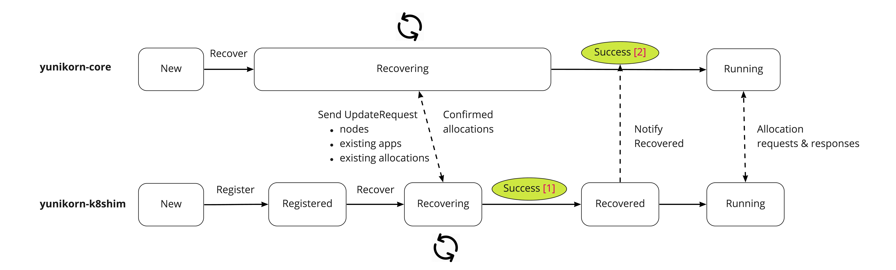
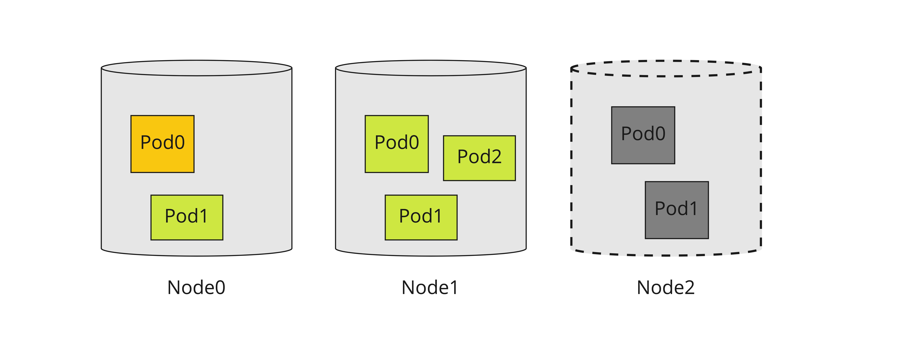

# Resilience Design

This is not a HA (High-availability) design, HA implies that a service can
survive from a fatal software/hardware failure. That requires one or more
standby instances providing same services to take over active instance on failures.
Resilience here means for yunikorn, we can restart it without losing its state.

## The problem

YuniKorn is designed as a stateless service, it doesn't persist its state, e.g
applications/queues/allocations etc, to any persistent storage. All states are
in memory only. This design ensures yunikorn to be able to response requests with
low latency, and deployment mode is simple. However, a restart (or recovery) will
have the problem to lose state data. We need a decent way to reconstruct all
previous states on a restart.

## Design

### Workflow

Scheduler core has no notion of "state", which means it does not know if it is under recovering.
It is too complex to main a series of `scheduler states` in both core and shim, because we must
keep them in-sync. However, if we live under a simple assumption: **scheduler core only responses
requests, the correction of requests is ensured by shim according its current state**.
The design becomes much simpler. This way, the shim maintains a state machine like below. When
it is under `running` state, it sends new requests to the scheduler core as long as a new one is found;
when under `recovering` state, it collects previous allocations and send recovery messages to
the scheduler core, and waiting for recovery to be accomplished.

Shim scheduler state machine

```
      Register                            Run
New ------------> Registered ------------------------------> Running
                      |                                         ^
                      |     Recover                   Success   |
                       --------------> Recovering ---------------
                                           |   Fail
                                            ---------> Failed
```

Following chart illustrate how yunikorn-core and shim works together on recovery.



Restart (with recovery) process
- start yunikorn shim with option "recover"
- yunikorn shim enters "recovering" state. Under "recovering" state, the shim only scans existing nodes and allocations, no new scheduling requests will be sent.
- shim register itself with yunikorn-core
- shim starts recovering
  - shim detects nodes added from node informer and added them to cache
  - shim detects pods added from pod informer, filter out the pods that already assigned (scheduled to a node), and added that to cache (allocation in that node)
  - shim sends update request to yunikorn-core with the info found in previous steps
- yunikorn-core handles update requests, the steps should look like a replay of allocation process, including
  - adding node
  - adding applications
  - adding allocations
  - modifying queue resources
  - update partition info
- when all nodes are fully recovered, shim transits the state to "running"
- shim notifies yunikorn-core that recovery is done, then yunikorn-core transits to "running" state.

### How to determine recovery is complete?

Shim queries K8s api-server to get how many nodes were available in this cluster. It tracks the recovering status of each node.
Once all nodes are recovered, it can claim the recovery is completed. This approach requires us to add `recovering` and `recovered`
states to nodes' state machine in the shim.

### Node recovery

In the shim layer, it maintains states for each node and pods running on this node. When start to recover nodes,
all nodes initially are considered as under `recovering`. Only when all pods running on this node are fully recovered,
the node can be considered as `recovered`.



Like demonstrated on upon diagram,

- Node0 is still recovering because pod0 is recovering.
- Node1 is recovered (become schedulable) because all pods on this node have been recovered.
- Node2 is lost, shim lost contact with this node. If after sometime this node comes back, shim should still try to recover this node.

