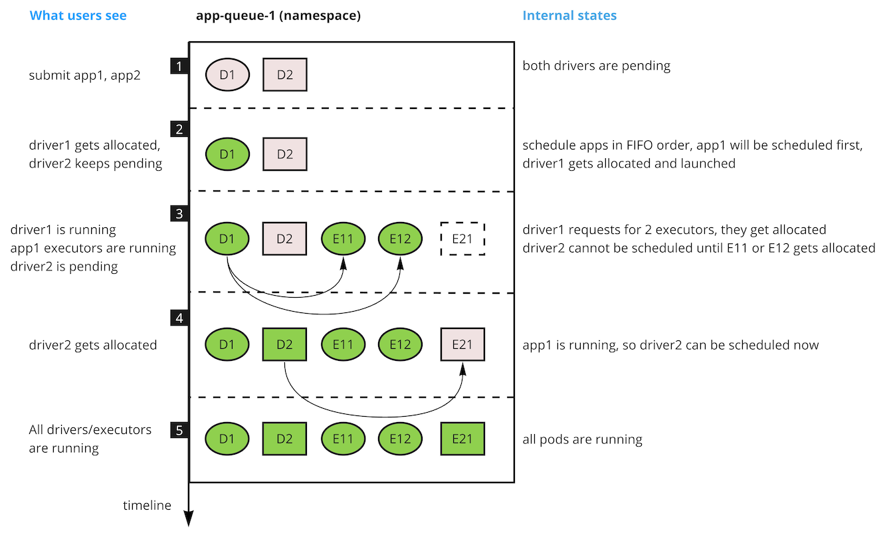

<!--
 * Licensed to the Apache Software Foundation (ASF) under one
 * or more contributor license agreements.  See the NOTICE file
 * distributed with this work for additional information
 * regarding copyright ownership.  The ASF licenses this file
 * to you under the Apache License, Version 2.0 (the
 * "License"); you may not use this file except in compliance
 * with the License.  You may obtain a copy of the License at
 *
 *     http://www.apache.org/licenses/LICENSE-2.0
 *
 * Unless required by applicable law or agreed to in writing, software
 * distributed under the License is distributed on an "AS IS" BASIS,
 * WITHOUT WARRANTIES OR CONDITIONS OF ANY KIND, either express or implied.
 * See the License for the specific language governing permissions and
 * limitations under the License.
 -->
# Scheduling for batch workloads  

## The problem
A common pattern while processing data is that the application can be divided into multiple stages.
Another way to look at this is the fact that processing needs to be kicked off and that the first step is to start a driver or manager for the application.
Later stages might depend on the previous stages.
When running applications in a size limited environment this could lead to a resource exhaustion when submitting multiple applications at the same time.
These first stages might consume all available resources leaving no room for the next stage(s) to start.
Often this issue is caused by having a high number of applications start simultaneous and trying to get resources in parallel.
### Example issue
When submitting numerous Spark applications in a short amount of time the drivers will all be started shortly after each other.
The drivers consume all available resources in a queue or in the whole cluster.
After starting the drivers they will request resources for the executors. 
Since the queue or cluster has no resources left the executors will not be started.
The driver cannot progress. 
The only way that progress would be made is if and when one of the drivers finishes or fails and frees up resources for executors to be started.

## Design
### Design goals
1. Prevent resource exhaustion by first stage allocations
1. Improve chance for jobs to get minimal required resources over others

### None goals
1. This is NOT an implementation of Gang scheduling.
1. No change to the currently supported FAIR or FIFO scheduling algorithms
1. Fix resource quota usage outside of the core scheduler for submitted but waiting applications

### Possible solutions
Other batch schedulers like the YARN schedulers use a limit on the number of simultaneous running applications.
They use either resource constraints on the driver or management stage or set a hard limit of the number of applications that can run in a queue.
The draw back of that solution is that it does not work well in a cluster that can scale up or down automatically in a cloud environment.
To work around that percentage based limits could be set on the consumed resources for the driver or management stage.
This does not alleviate the fact that driver or management stages can be of any size, large and or small, which complicates the percentage scenario further as it does not give a predictable behaviour.

A different solution would be to assume a specific behaviour of the applications.
Using that assumption a limit on the applications could be set based on the state it is in.
The spark driver and executor behaviour is the most usual use case.
This would provide a way to limit scheduling to existing applications and only drip feed new applications into the list of applications to schedule when there are resources available.

### Algorithm
The algorithm described here is based on the drip feed of new applications into the applications to schedule based on the states of all applications.
Scheduling is based on the applications in a queue.
The algorithm will be applied at a queue level.
This is not a cluster wide setup.

What we want to achieve is the following behaviour: only schedule one (1) application that is in its early stage(s) (called a starting state) at the same time.
Only consider another new application if and when the previous application has transitioned out of the starting state.
Applications will always be allocated resources on a first in first out basis based on submission time.
That means that an application that is newly added and in its starting phase will only get resources if applications in the later stages do not need any resources.

This algorithm will be implemented as an application sorting policy on a queue.
This allows specific queues to limit parallel application startup while other queues with different work loads can schedule without or with different limitations.

### Fallback mechanism
A fallback mechanism has to be built into the algorithm.
Not all applications will request more than one allocation.
The other case that has to be accounted for could be a misbehaving or a slow application.
Having an application stuck in the starting state could cause a scheduler livelock and starvation of other applications.

The fall back mechanism proposed is as simple as a time limit on the starting state.
This means that any application auto progresses out of the starting state.
The time limit will be set to five (5) minutes hard coded as a starting point and will not be made configurable.

The other fallback mechanism considered was making the number of allocations for the starting state configurable.
This option provided a number of issues which made it difficult to implement.
One of the main stumbling blocks is the fact that it requires the application submitter to specify the value.
It also does not guarantee that the application will leave the starting state either and does not fix the livelock issue.
If an application was submitted with five required allocation but due to issues during the run never asked for more than four then the livelock would still occur.

Setting a default of zero (0) would also not work as it would bypass the starting state.
It would make the sorting policy an opt-in instead of an opt-out.
Setting a default of one (1) does not give us much enhancement to what we currently propose.
It makes the sorting policy an opt-out but does not give the cluster administrator any control over the scheduling behaviour.
Weighing those against each other the proposal is to not make this configurable.

### Example run
Using Spark applications as an example: a new application can only be scheduled if the previous application has at least one (1) executor allocated.

Assume we have the following Spark apps: App1 & App2 as in the diagram above. The applications were submitted in that order: App1 first, then App2. They were both submitted to the same queue.

1. Both applications are in the queue waiting for the first allocation: accepted by the scheduler. App1 has requested driver D1 and App2 has requested driver D2.
1. The scheduler sorts the application and allows 1 accepted application to be scheduled (no starting applications yet): App1 as the oldest applications with an outstanding request is scheduled.  
App1 is allocated its driver (D1) and progresses to starting.  
App2 request for a driver is ignored as the scheduler is starting App1 (only 1 application in starting or accepted state is scheduled).
1. App1 requests executors E11 and E12. The scheduler assigns E11 and E12. At this point the application state changes to running when it has at least 1 executor allocated.
1. App2 has been waiting to get the driver allocated. Since there are no applications in a starting state the scheduler looks at App2 which is in an accepted state. App2 moves from the accepted state to starting when the driver is allocated.
1. App2 requests its executor E21. The application state changes to running when E21 is allocated.

This process would repeat itself for any new application submitted.