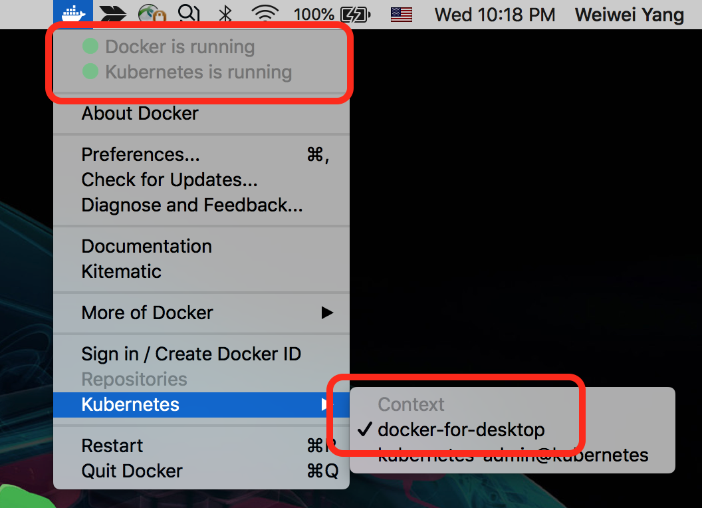
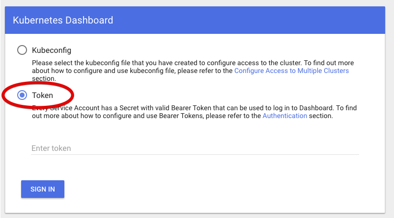
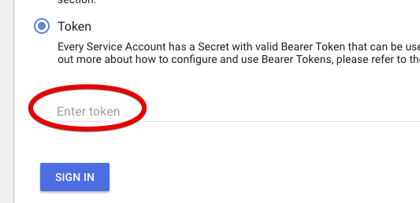

# Environment Setup

## 1. Setup a Local Kubernetes cluster on laptop

There are several ways to setup a local development environment for Kubernetes, the two most common ones are `Minikube` ([docs](https://kubernetes.io/docs/setup/minikube/)) and `docker-desktop`.
`Minikube` provisions a local Kubernetes cluster on several Virtual Machines (via VirtualBox or something similar). `docker-desktop` on the other hand, sets up Kubernetes cluster in docker containers.
In this tutorial, we'll use the latter approach, which is simpler and lightweight.

### 1.1 Installation

Download and install [Docker-Desktop](https://www.docker.com/products/docker-desktop) on your laptop. Latest version has an embedded version of Kubernetes so no additional install is needed.
Just simply follow the instruction [here](https://docs.docker.com/docker-for-mac/#kubernetes) to get Kubernetes up and running within docker-desktop.

Once Kubernetes is started in docker desktop, you should see something similar below:



This means that:
1. Kubernetes is running.
2. The command line tool `kubctl` is installed in the `/usr/local/bin` directory.
2. The kubernetes context is set to `docker-desktop`.

### 1.2 Deploy and Access dashboard

After setting up the local kubernetes you need to deploy the dashboard using the following steps: 
1. Follow the instructions in [Kubernetes dashboard doc](https://github.com/kubernetes/dashboard) to deploy the dashboard.
2. Start the kubernetes proxy in the background from a terminal to get access on the dashboard on the local host:   
`kubectl proxy &`
3. Access the dashboard at the following URL: [clickable link](http://localhost:8001/api/v1/namespaces/kube-system/services/https:kubernetes-dashboard:/proxy/#!/login)

### 1.3 Access local Kubernetes cluster

The dashboard as deployed in the previous step requires a token or config to sign in. Here we use the token to sign in. The token is generated automatically and can be retrieved from the system.

1. Retrieve the name of the dashboard token:   
`kubectl -n kube-system get secret | grep kubernetes-dashboard-token`
2. Retrieve the content of the token, note that the token name ends with a random 5 character code and needs to be replaced with the result of step 1. As an example:  
`kubectl -n kube-system describe secret kubernetes-dashboard-token-tf6n8`
3. Copy the token value which is part of the `Data` section with the tag `token`.
4. Select the **Token** option in the dashboard web UI:

5. Paste the token value into the input box and sign in:   


### 1.4 Access remote Kubernetes cluster

This setup assumes you have already installed a remote Kubernetes cluster. 

1. Get kube `config` file from remote cluster, copy to the laptop
2. Properly set kubectl context with the new config (Detail step to be added...)
3. Switch context using `kubectl config use-context kubernetes-admin@kubernetes`

```
kubectl config get-contexts
CURRENT   NAME                          CLUSTER                      AUTHINFO             NAMESPACE
          docker-for-desktop            docker-for-desktop-cluster   docker-for-desktop
*         kubernetes-admin@kubernetes   kubernetes                   kubernetes-admin
```

More docs can be found [here](https://kubernetes.io/docs/tasks/access-application-cluster/configure-access-multiple-clusters/)  
