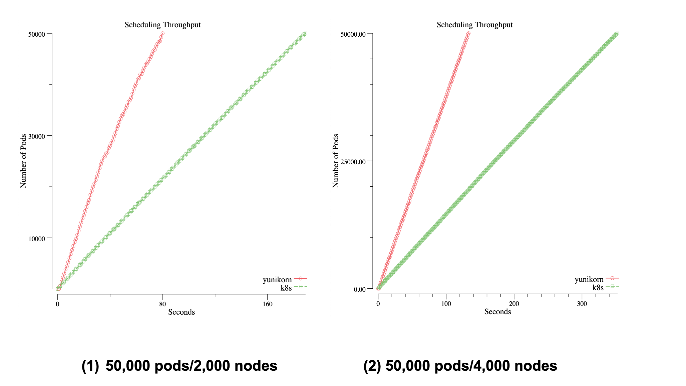
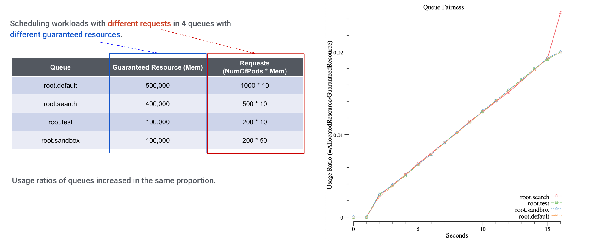
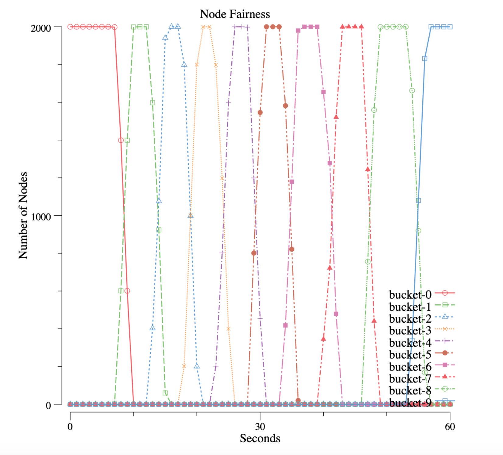
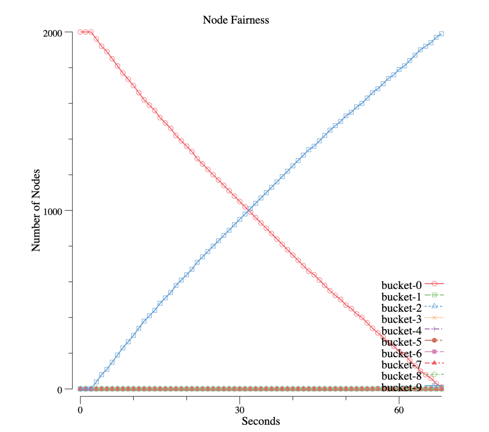

# Evaluate YuniKorn function & performance with Kubemark

All the following tests are done with [Kubemark](https://github.com/kubernetes/kubernetes/blob/release-1.3/docs/devel/kubemark-guide.md#starting-a-kubemark-cluster),
a tool helps us to simulate large K8s cluster and run experimental workloads.
There were 18 bare-metal servers being used to simulate 2000/4000 nodes for these tests. 

## Scheduler Throughput

When running Big Data batch workloads, e.g Spark, on K8s, scheduler throughput becomes to be one of the main concerns.
In YuniKorn, we have done lots of optimizations to improve the performance, such as a fully async event-driven system
and low-latency sorting policies. The following chart reveals the scheduler throughput (by using Kubemark simulated
environment, and launching 50,000 pods with heterogeneous resource requests ), comparing to the K8s default scheduler.

The charts record the time spent until all pods are running on the cluster

|                       	| THROUGHPUT (pods/sec) 	| THROUGHPUT (pods/sec) 	|
|-----------------------	|:---------------------:	|:---------------------:	|
| ENVIRONMENT (# nodes) 	|   Default Scheduler   	|        YuniKorn       	|
| 2000                  	| 263                   	| 617                   	|
| 4000                  	| 141                   	| 373                   	|

## Resource Fairness between queues

Each of YuniKorn queues has its guaranteed and maximum capacity. When we have lots of jobs submitted to these queues,
YuniKorn ensures each of them gets its fair share. When we monitor the resource usage of these queues, we can clearly
see how fairness was enforced:

We set up 4 heterogeneous queues on this cluster, and submit different workloads against these queues.
From the chart, we can see the queue resources are increasing nearly in the same trend, which means the resource
fairness across queues is honored.

## Node sorting policies

There are 2 node sorting policies available in YuniKorn, with regarding the pod distributing flavors. One is *FAIR*,
which tries best to evenly distribute pods to nodes; the other one is *BIN-PACKING*, which tries best to bin pack pods
to less number of nodes. The former one is suitable for the Data Center scenarios, it helps to balance the stress of
cluster nodes; the latter one is suitable to be used on Cloud, it can minimize the number of instances when working
with auto-scaler, in order to save cost.

### FAIR Policy

We group nodes into 10 buckets, each bucket represents for the number of nodes that has a similar resource
utilization (a range).  To help you understand the chart, imagine the buckets have the following values at a certain
point of time:

|   BUCKET 	| RESOURCE UTILIZATION RANGE 	| VALUE 	|
|:--------:	|:--------------------------:	|:-----:	|
| bucket-0 	| 0% - 10%                   	| 100   	|
| bucket-1 	| 10% - 20%                  	| 300   	|
| ...      	|                            	|       	|
| bucket-9 	| 90% - 100%                 	| 0     	|

This means at the given time, this cluster has 100 nodes whose utilization is in the range 0% to 10%;
it has 300 nodes whose utilization is in the range 10% - 20%, and so on… Now, we run lots of workloads and
collect metrics, see the below chart:

We can see all nodes have 0% utilization, and then all of them move to bucket-1, then bucket-2 … and eventually
all nodes moved to bucket-9, which means all capacity is used. In another word, nodes’ resource has been used in
a fairness manner.

### BIN-PACKING

This is When the bin-packing policy is enabled, we can see the following pattern:

On the contrary, all nodes are moving between 2 buckets, bucket-0 and bucket-9. Nodes in bucket-0 (0% - 10%)
are decreasing in a linear manner, and nodes in bucket-9 (90% - 100%) are increasing with the same curve.
In other words, node resources are being used up one by one.

