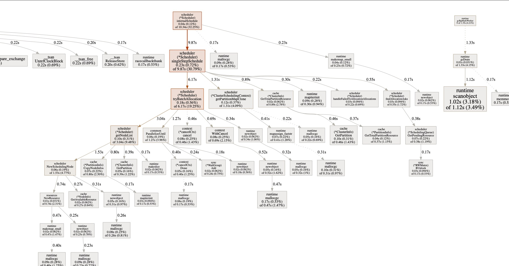

<!--
 * Licensed to the Apache Software Foundation (ASF) under one
 * or more contributor license agreements.  See the NOTICE file
 * distributed with this work for additional information
 * regarding copyright ownership.  The ASF licenses this file
 * to you under the Apache License, Version 2.0 (the
 * "License"); you may not use this file except in compliance
 * with the License.  You may obtain a copy of the License at
 *
 *     http://www.apache.org/licenses/LICENSE-2.0
 *
 * Unless required by applicable law or agreed to in writing, software
 * distributed under the License is distributed on an "AS IS" BASIS,
 * WITHOUT WARRANTIES OR CONDITIONS OF ANY KIND, either express or implied.
 * See the License for the specific language governing permissions and
 * limitations under the License.
 -->

# Profiling Scheduler

Use [pprof](https://github.com/google/pprof) to do CPU, Memory profiling can help you understand the runtime status of YuniKorn scheduler. Profiling instruments have been
added to YuniKorn rest service, we can easily retrieve and analyze them from HTTP
endpoints.

## CPU profiling

At this step, ensure you already have YuniKorn running, it can be either running from
local via a `make run` command, or deployed as a pod running inside of K8s. Then run

```
go tool pprof http://localhost:9080/debug/pprof/profile
```

The profile data will be saved on local file system, once that is done, it enters into
the interactive mode. Now you can run profiling commands, such as

```
(pprof) top
Showing nodes accounting for 14380ms, 44.85% of 32060ms total
Dropped 145 nodes (cum <= 160.30ms)
Showing top 10 nodes out of 106
      flat  flat%   sum%        cum   cum%
    2130ms  6.64%  6.64%     2130ms  6.64%  __tsan_read
    1950ms  6.08% 12.73%     1950ms  6.08%  __tsan::MetaMap::FreeRange
    1920ms  5.99% 18.71%     1920ms  5.99%  __tsan::MetaMap::GetAndLock
    1900ms  5.93% 24.64%     1900ms  5.93%  racecall
    1290ms  4.02% 28.67%     1290ms  4.02%  __tsan_write
    1090ms  3.40% 32.06%     3270ms 10.20%  runtime.mallocgc
    1080ms  3.37% 35.43%     1080ms  3.37%  __tsan_func_enter
    1020ms  3.18% 38.62%     1120ms  3.49%  runtime.scanobject
    1010ms  3.15% 41.77%     1010ms  3.15%  runtime.nanotime
     990ms  3.09% 44.85%      990ms  3.09%  __tsan::DenseSlabAlloc::Refill
```

you can type command such as `web` or `gif` to get a graph that helps you better
understand the overall performance on critical code paths. You can get something
like below:



Note, in order to use these
options, you need to install the virtualization tool `graphviz` first, if you are using Mac, simply run `brew install graphviz`, for more info please refer [here](https://graphviz.gitlab.io/).

## Memory Profiling

Similarly, you can run

```
go tool pprof http://localhost:9080/debug/pprof/heap
```

this will return a snapshot of current heap which allows us to check memory usage.
Once it enters the interactive mode, you can run some useful commands. Such as
top can list top memory consumption objects.
```
(pprof) top
Showing nodes accounting for 83.58MB, 98.82% of 84.58MB total
Showing top 10 nodes out of 86
      flat  flat%   sum%        cum   cum%
      32MB 37.84% 37.84%       32MB 37.84%  github.com/apache/incubator-yunikorn-core/pkg/cache.NewClusterInfo
      16MB 18.92% 56.75%       16MB 18.92%  github.com/apache/incubator-yunikorn-core/pkg/rmproxy.NewRMProxy
      16MB 18.92% 75.67%       16MB 18.92%  github.com/apache/incubator-yunikorn-core/pkg/scheduler.NewScheduler
      16MB 18.92% 94.59%       16MB 18.92%  github.com/apache/incubator-yunikorn-k8shim/pkg/dispatcher.init.0.func1
    1.04MB  1.23% 95.81%     1.04MB  1.23%  k8s.io/apimachinery/pkg/runtime.(*Scheme).AddKnownTypeWithName
    0.52MB  0.61% 96.43%     0.52MB  0.61%  github.com/gogo/protobuf/proto.RegisterType
    0.51MB  0.61% 97.04%     0.51MB  0.61%  sync.(*Map).Store
    0.50MB   0.6% 97.63%     0.50MB   0.6%  regexp.onePassCopy
    0.50MB  0.59% 98.23%     0.50MB  0.59%  github.com/json-iterator/go.(*Iterator).ReadString
    0.50MB  0.59% 98.82%     0.50MB  0.59%  text/template/parse.(*Tree).newText
```

you can also run `web`, `pdf` or `gif` command to get the graph for heap.

## Download profiling samples and analyze it locally

We have included essential go/go-tool binaries in scheduler docker image, you should be able to do some basic profiling
analysis inside of the docker container. However, if you want to dig into some issues, it might be better to do the analysis
locally. Then you need to copy the samples file to local environment first. The command to copy files is like following:

```
kubectl cp ${SCHEDULER_POD_NAME}:${SAMPLE_PATH_IN_DOCKER_CONTAINER} ${LOCAL_COPY_PATH}
```

for example

```
kubectl cp yunikorn-scheduler-cf8f8dd8-6szh5:/root/pprof/pprof.k8s_yunikorn_scheduler.samples.cpu.001.pb.gz /Users/wyang/Downloads/pprof.k8s_yunikorn_scheduler.samples.cpu.001.pb.gz
```

once you get the file in your local environment, then you can run the `pprof` command for analysis.

```
go tool pprof /Users/wyang/Downloads/pprof.k8s_yunikorn_scheduler.samples.cpu.001.pb.gz
```

## Resources

* pprof Document https://github.com/google/pprof/tree/master/doc.
