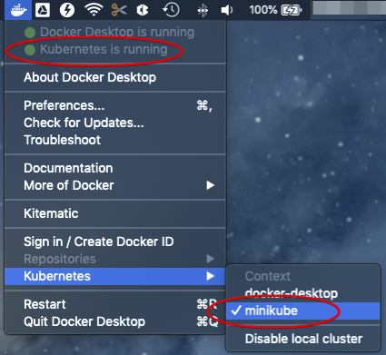

# Environment Setup

There are several ways to setup a local development environment for Kubernetes, the two most common ones are `Minikube` ([docs](https://kubernetes.io/docs/setup/minikube/)) and `docker-desktop`.
`Minikube` provisions a local Kubernetes cluster on several Virtual Machines (via VirtualBox or something similar). `docker-desktop` on the other hand, sets up Kubernetes cluster in docker containers.

## Local Kubernetes cluster using Docker Desktop

In this tutorial, we will base all the installs on Docker Desktop.
Even in this case we can use a lightweight [minikube](#local-kubernetes-cluster-with-minikube) setup which gives the same functionality with less impact.

### Installation

Download and install [Docker-Desktop](https://www.docker.com/products/docker-desktop) on your laptop. Latest version has an embedded version of Kubernetes so no additional install is needed.
Just simply follow the instruction [here](https://docs.docker.com/docker-for-mac/#kubernetes) to get Kubernetes up and running within docker-desktop.

Once Kubernetes is started in docker desktop, you should see something similar below:


This means that:
1. Kubernetes is running.
1. the command line tool `kubctl` is installed in the `/usr/local/bin` directory.
1. the Kubernetes context is set to `docker-desktop`.

### Deploy and access dashboard

After setting up the local Kubernetes you need to deploy the dashboard using the following steps: 
1. follow the instructions in [Kubernetes dashboard doc](https://github.com/kubernetes/dashboard) to deploy the dashboard.
1. start the Kubernetes proxy in the background from a terminal to get access on the dashboard on the local host:   
    ```shell script
    kubectl proxy &
    ```
1. access the dashboard at the following URL: [clickable link](http://localhost:8001/api/v1/namespaces/kube-system/services/https:kubernetes-dashboard:/proxy/#!/login)

### Access local Kubernetes cluster

The dashboard as deployed in the previous step requires a token or config to sign in. Here we use the token to sign in. The token is generated automatically and can be retrieved from the system.

1. retrieve the name of the dashboard token:   
    ```shell script
    kubectl -n kube-system get secret | grep kubernetes-dashboard-token
    ```
2. retrieve the content of the token, note that the token name ends with a random 5 character code and needs to be replaced with the result of step 1. As an example:  
    ```shell script
    kubectl -n kube-system describe secret kubernetes-dashboard-token-tf6n8
    ```
3. copy the token value which is part of the `Data` section with the tag `token`.
4. select the **Token** option in the dashboard web UI:<br>
    
5. paste the token value into the input box and sign in:<br>
    

## Local Kubernetes cluster with minikube
Minikube can be added to an existing Docker Desktop install. Minikube can either use the pre-installed hypervisor or use a hypervisor of choice. These instructions use [HyperKit](https://github.com/moby/hyperkit) which is embedded in Docker Desktop.   

If you want to use a different hypervisor then HyperKit make sure that you follow the generic minikube install instructions. Do not forget to install the correct driver for the chosen hypervisor if required.
The basic instructions are provided in the [minikube install](https://kubernetes.io/docs/tasks/tools/install-minikube/) instructions.

Check hypervisor
 Docker Desktop should have already installed HyperKit. In a terminal run: `hyperkit` to confirm. Any response other than `hyperkit: command not found` confirms that HyperKit is installed and on the path. If it is not found you can choose a different hypervisor or fix the Docker Desktop install.

### Installing minikube
1. install minikube, you can either use brew or directly via these steps: 
    ```shell script
    
curl -Lo minikube https://storage.googleapis.com/minikube/releases/latest/minikube-darwin-amd64
    chmod +x minikube

    sudo mv minikube /usr/local/bin
    ```
1. install HyperKit driver
 (required), you can either use brew or directly via these steps:
    ```shell script
    curl -LO https://storage.googleapis.com/minikube/releases/latest/docker-machine-driver-hyperkit
    sudo install -o root -g wheel -m 4755 docker-machine-driver-hyperkit /usr/local/bin/
    ```
1. update the minikube config to default to the HyperKit install
 `minikube config set vm-driver hyperkit`
1. change docker desktop to use minikube for Kubernetes:<br>
    

### Deploy and access the cluster
After the installation is done you can start a new cluster.
1. start the minikube cluster: `minikube start --kubernetes-version v1.14.2`
1. start the minikube dashboard: `
minikube dashboard &`

### Build impact
When you create images make sure that the build is run after pointing it to the right environment. 
Without setting the enviromnent minikube might not find the docker images when deploying the scheduler.
1. make sure minikube is started
1. in the terminal where you wll run the build execute: `eval $(minikube docker-env)`
1. run the image build from the yunikorn-k8shim repository root: `make image`
1. deploy the scheduler as per the normal instructions.

## Debug code locally

Note, this instruction requires you have GoLand IDE for development.

In GoLand, go to yunikorn-k8shim project. Then click "Run" -> "Debug..." -> "Edit Configuration..." to get the pop-up configuration window.
Note, you need to click "+" to create a new profile if the `Go Build` option is not available at the first time.


The highlighted fields are the configurations you need to add. These include:

- Run Kind: package
- Package path: point to the path of `pkg/shim` package
- Working directory: point to the path of the `conf` directory, this is where the program loads configuration file from
- Program arguments: specify the arguments to run the program, such as `-kubeConfig=/path/to/.kube/config -interval=1s -clusterId=mycluster -clusterVersion=0.1 -name=yunikorn -policyGroup=queues -logEncoding=console -logLevel=-1`.
Note, you need to replace `/path/to/.kube/config` with the local path to the kubeconfig file. And if you want to change or add more options, you can run `_output/bin/k8s-yunikorn-scheduler -h` to find out.

Once the changes are done, click "Apply", then "Debug". You will need to set proper breakpoints in order to debug the program.

## Access remote Kubernetes cluster

This setup assumes you have already installed a remote Kubernetes cluster. 
For a generic view on how to access a multiple cluster and integrate it follow the [accessing multiple clusters](https://kubernetes.io/docs/tasks/access-application-cluster/configure-access-multiple-clusters/) documentation from Kubernetes.

Or follow these simplified steps:
1. get the Kubernetes `config` file from remote cluster, copy it to the local machine and give it a unique name i.e. `config-remote`
1. save the `KUBECONFIG` environment variable (if set)
    ```shell script
    export KUBECONFIG_SAVED=$KUBECONFIG
    ```
1. add the new file to the environment variable
    ```shell script
    export KUBECONFIG=$KUBECONFIG:config-remote
    ``` 
1. run the command `kubectl config view` to check that both configs can be accessed
1. switch context using `kubectl config use-context my-remote-cluster`
1. confirm that the current context is now switched to the remote cluster config:
    ```text
    kubectl config get-contexts
    CURRENT   NAME                   CLUSTER                      AUTHINFO             NAMESPACE
              docker-for-desktop     docker-for-desktop-cluster   docker-for-desktop
    *         my-remote-cluster      kubernetes                   kubernetes-admin
    ```

More docs can be found [here](https://kubernetes.io/docs/concepts/configuration/organize-cluster-access-kubeconfig/)  
